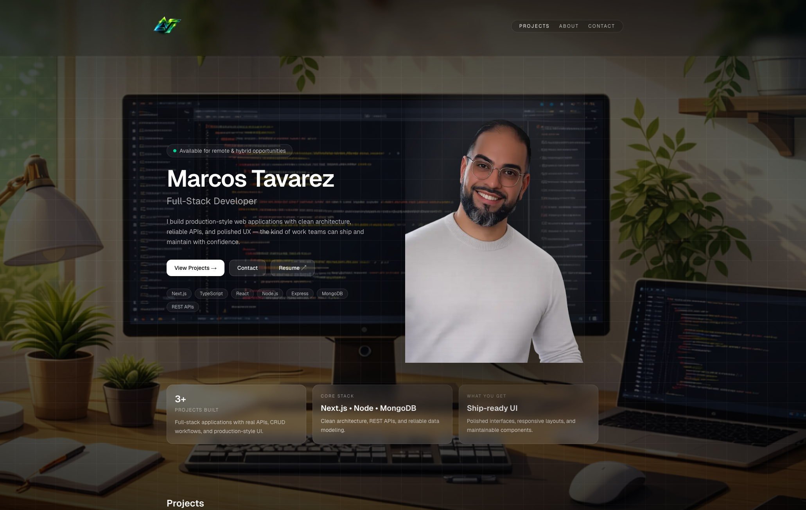
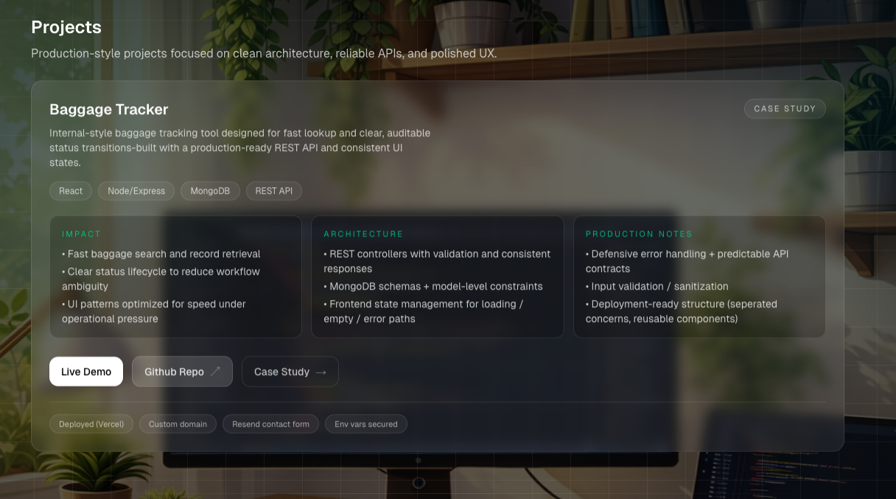

# 🌐 Personal Portfolio — Marcos Tavarez

A production-grade portfolio showcasing my work as a **Full-Stack Developer**, focused on building scalable applications, clean user interfaces, and real-world solutions.

---

## 🚀 Live Website
👉 https://marcostavarez.com

---

## 🖼️ Preview

### Hero Section

  

### Projects Section

  

 
 

---

## 🧠 Features

- ⚡  **Modern, responsive design** optimized for performance  
- 🎨 **Clean, ergonomic UI/UX** with smooth interactions  
- 📂 **Project showcase** with live demos and GitHub repos  
- 🧑‍💻 **Production-style applications** focused on real-world use  
- 🌐 **Fully deployed** and optimized on Vercel  

---

## 🏗️ Tech Stack

- Next.js (App Router)
- TypeScript
- Tailwind CSS
- Framer Motion

---

## 💡 Highlights

- Built multiple full-stack applications with authentication and database integration  
- Focus on clean architecture, maintainability, and user experience  
- Experience deploying and debugging production applications  

---

## 📂 Featured Projects

### 🔹 Baggage Tracker  
Internal-style baggage tracking system with REST API, status lifecycle management, and production-ready architecture  
👉 https://github.com/Mtavarez0625/baggage-tracker  

### 🔹 Expense Tracker (AI Powered)  
Full-stack expense management app with authentication, analytics, and AI-generated financial insights  
👉 https://github.com/Mtavarez0625/expense-tracker  

---

## 📌 Purpose

This portfolio was built to present my work in a **professional, production-ready format** and demonstrate my ability to design and develop full-stack applications from concept to deployment.

---

## 👤 Author

**Marcos Tavarez**  
Full Stack Developer  
Available for remote & hybrid opportunities
